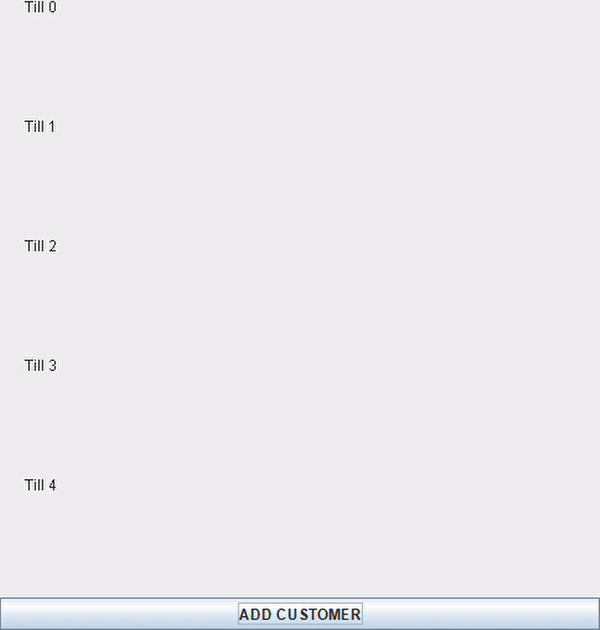

[![LinkedIn][linkedin-shield]][linkedin-url]

 

  <h3 align="center">Checkout Lines</h3>

  

   simulating checkout lines
     
  

<!-- TABLE OF CONTENTS -->

  
Table of Contents

  <ol>
    <li>
      <a href="#about-the-project">About The Project</a>
      <ul>
        <li><a href="#built-with">Built With</a></li>
      </ul>
    </li>
    <li><a href="#contact">Contact</a></li>
  </ol>

<!-- ABOUT THE PROJECT -->
## About The Project
Learning how to use linked lists, queues and stacks. This was an assignment for the module datastructures and algorithms. It is a program that represents checkoutlines. The people go to the shortest queue then leave one by one. People are added by clicking a button.

I later attempted to make a visual representation which never worked out so good cause the people dont appear in the correct queue at the exact time.

Maybe I'll debug it one day.

### Built With

Built with Java

<!-- CONTACT -->
## Contact

Linda Scoon - [@linda_scoon](https://twitter.com/linda_scoon) - Twitter

<!-- MARKDOWN LINKS & IMAGES --> 
[linkedin-shield]: https://img.shields.io/badge/-LinkedIn-black.svg?style=for-the-badge&logo=linkedin&colorB=555
[linkedin-url]: https://www.linkedin.com/in/linda-scoon/
